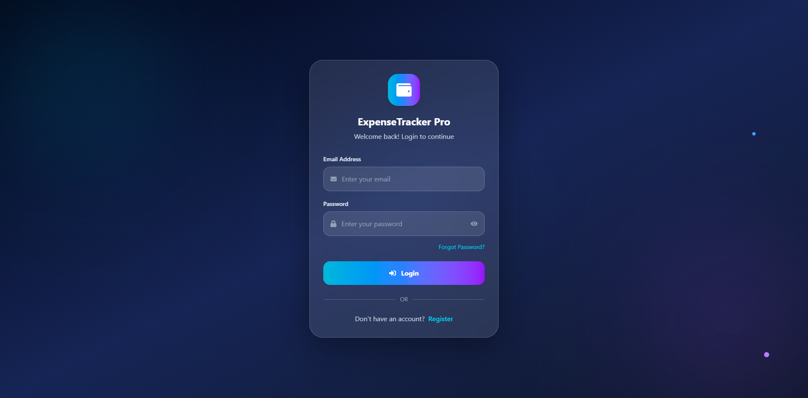
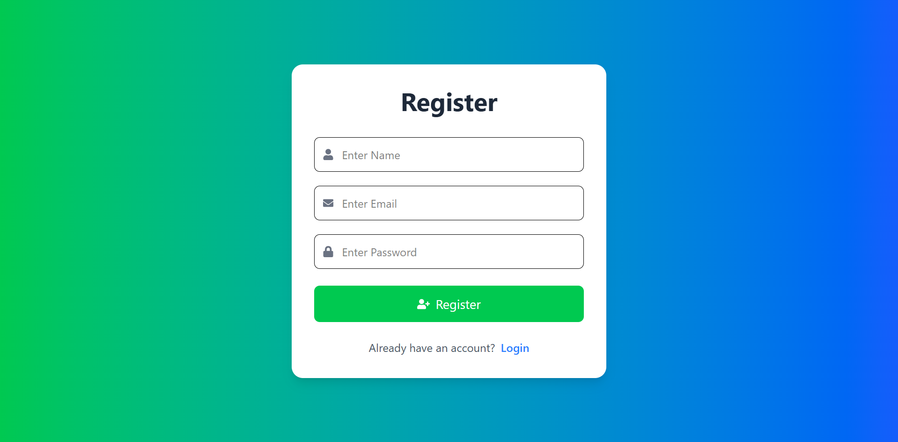
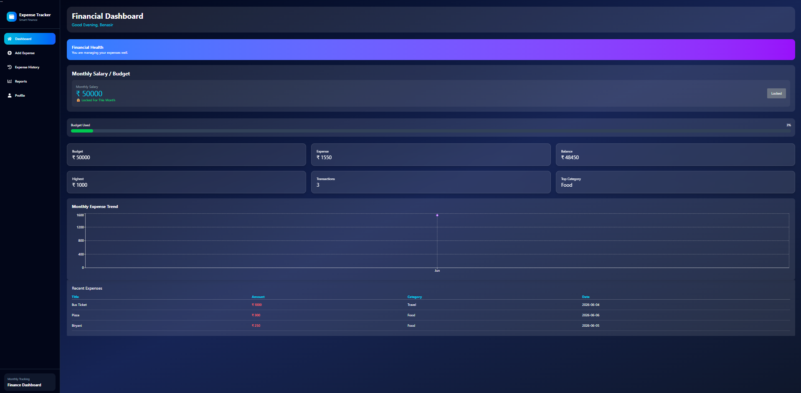
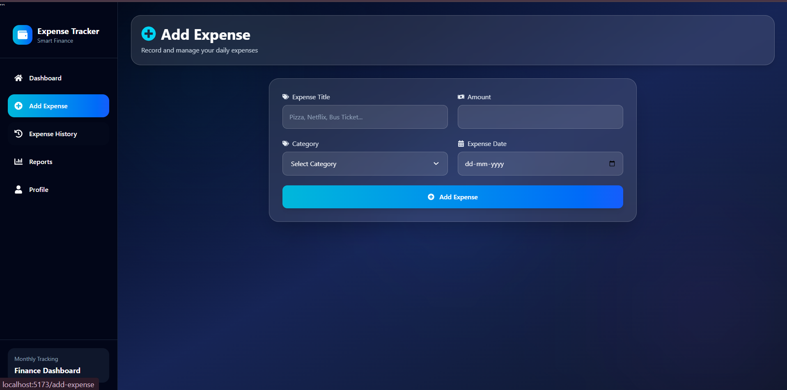
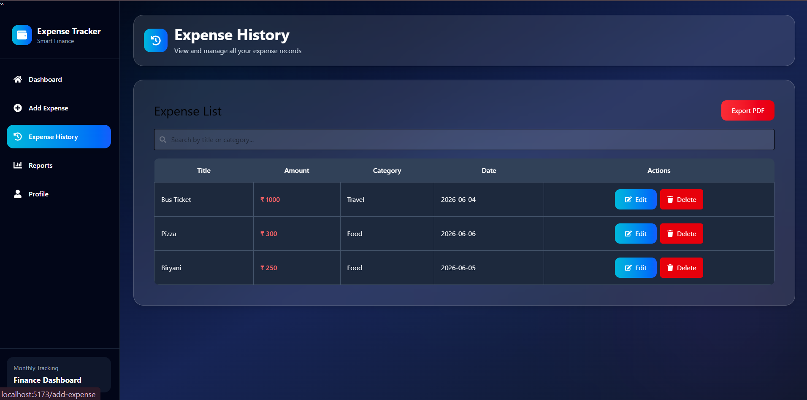
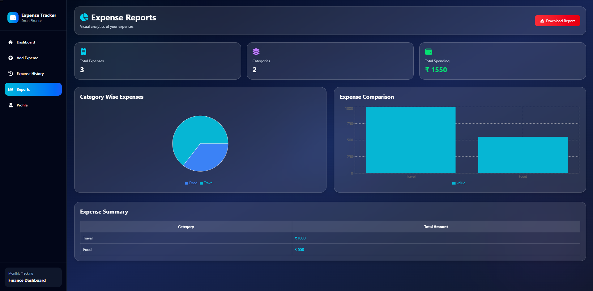
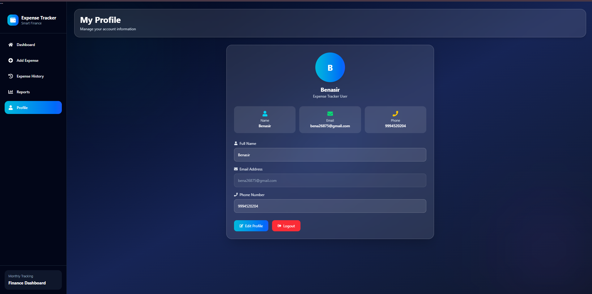
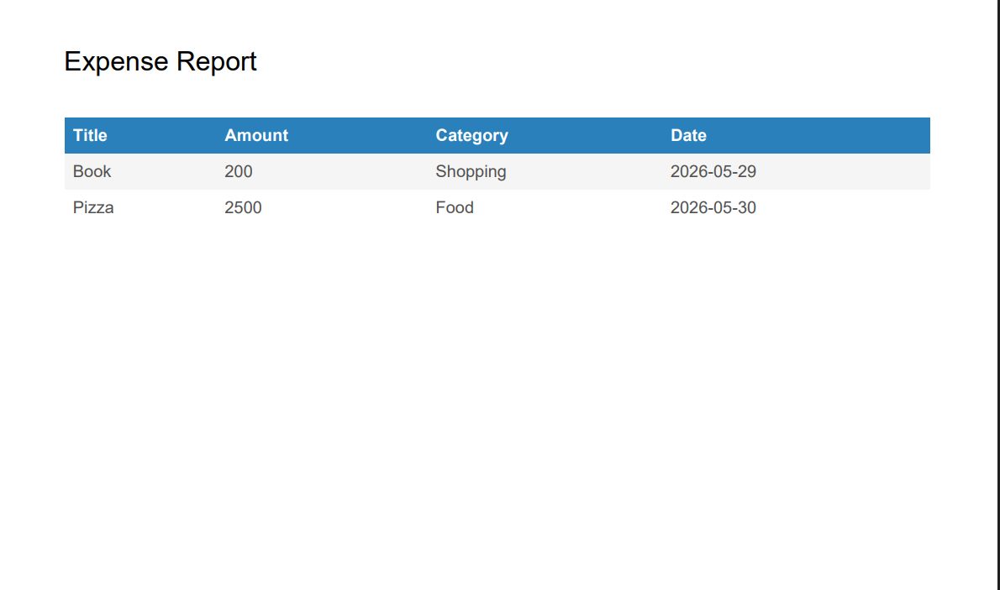

````md
# 💰 Smart Expense Tracker – Full Stack Project

A full-stack Expense Tracker application built using React and Spring Boot with MySQL database. It helps users track income and expenses with a clean dashboard and analytics.

---

## 🚀 Features

- User Login & Register (JWT Authentication)
- Add, Edit, Delete Expenses
- Category-wise Expense Tracking
- Search & Filter Expenses
- PDF Export of Reports
- Dashboard with Charts (Analytics)
- Responsive UI (Mobile Friendly)

---

## 🛠️ Tech Stack

### Frontend
- React.js
- Tailwind CSS
- React Icons
- Recharts
- jsPDF

### Backend
- Spring Boot
- Spring Data JPA
- Spring Security (JWT)
- MySQL

---

## 📊 Project Modules

- Authentication Module
- Expense Management Module
- Dashboard Analytics Module
- Report Generation Module

---

## 📸 Screenshots

### Login Page


### Register Page


### Dashboard


### Add Expense


### Expense List


### Charts & Analytics


### Profile Page


### Forgot Password


### PDF Report



## 🎯 Future Improvements

* Budget Alerts
* AI Expense Insights
* Email Notifications
* Dark Mode
* Multi-user role system

---

## 👨‍💻 Author

Developed by: **Benasir**

```
```
